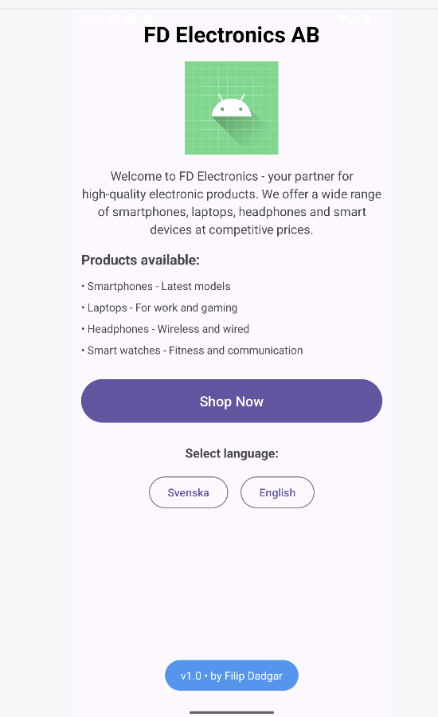
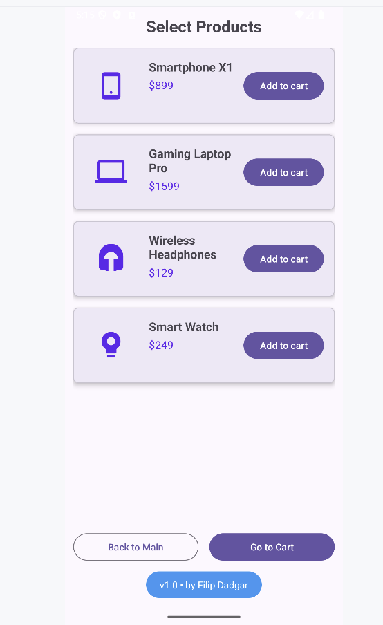
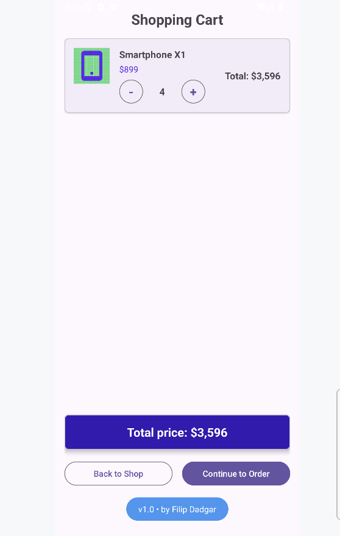

# FD Varukorg - Android Shopping Cart App

A complete Android e-commerce application developed with Kotlin that demonstrates modern Android development techniques and user experience.

## 📱 Overview

FD Varukorg is a fictional electronics store app that allows users to browse products, add them to a shopping cart, and complete a simulated order. The app supports both Swedish and English languages and implements modern Android architecture.

## Screenshots




## ✨ Features

### 🏠 MainActivity (Home Page)
- Company presentation for FD Electronics AB
- Product overview with descriptions
- Language selector (Swedish/English)
- Navigation to the shop

### 🛍️ ShopActivity (Product Catalog)
- Dynamic product list loaded from resource files
- Modern icons for each product category
- Add products to cart with toast notifications
- Navigation between activities

### 🛒 BasketActivity (Shopping Cart)
- Display all selected products with images and information
- Calculate and display total price
- Handle empty shopping carts
- Responsive design with RecyclerView

### ✅ ConfirmActivity (Order Confirmation)
- Form for delivery information (name, address, city)
- Payment information (card number)
- Validation of required fields
- Order confirmation with toast notifications

## 🎯 Technical Specifications

### Architecture & Patterns
- **MVVM-like architecture** with ViewBinding
- **Singleton pattern** for cart management (BasketManager)
- **RecyclerView** with custom adapters
- **Material Design** components

### Android Technologies
- **ViewBinding** - No findViewById calls
- **String Resources** - No hardcoded text
- **String Arrays** - Dynamic product loading
- **Internationalization** - Full support for Swedish and English
- **Vector Drawables** - Scalable product icons

### Data Management
```kotlin
// Products are loaded dynamically from string arrays
val productNames = resources.getStringArray(R.array.product_names)
val pricesSEK = resources.getStringArray(R.array.product_prices_sek)
val pricesUSD = resources.getStringArray(R.array.product_prices_usd)
```

## 🌍 Internationalization

The app supports automatic language switching between:
- **Swedish (sv)** - Prices in SEK
- **English (en)** - Prices in USD

All texts and prices are automatically adapted based on the user's choice.

## 📊 Product Catalog

| Product | SEK | USD |
|---------|-----|-----|
| Smartphone X1 | 8,999 kr | $899 |
| Gaming Laptop Pro | 15,999 kr | $1,599 |
| Wireless Headphones | 1,299 kr | $129 |
| Smart Watch | 2,499 kr | $249 |

## 🏗️ Project Structure

```
app/src/main/
├── java/com/filipdadgar/fd_varukorg/
│   ├── MainActivity.kt              # Home page with company info
│   ├── ShopActivity.kt              # Product catalog
│   ├── BasketActivity.kt            # Shopping cart
│   ├── ConfirmActivity.kt           # Order form
│   ├── Product.kt                   # Data models
│   ├── BasketManager.kt             # Singleton for cart management
│   ├── ProductAdapter.kt            # RecyclerView adapter for products
│   └── BasketAdapter.kt             # RecyclerView adapter for cart
├── res/
│   ├── layout/                      # UI layouts
│   ├── values/strings.xml           # Swedish string resources
│   ├── values-en/strings.xml        # English string resources
│   └── drawable/                    # Product icons and images
└── AndroidManifest.xml
```

## 🔧 Installation & Setup

### Prerequisites
- Android Studio Koala or later
- Android SDK (min API 28, target API 36)
- Kotlin 1.9+

### Steps
1. Clone the repository:
```bash
git clone https://github.com/filipdadgar/FD_Varukorg.git
```

2. Open the project in Android Studio

3. Sync Gradle files

4. Run the app on emulator or physical device

## 🎨 UI/UX Design

### Material Design 3
- Modern card components (MaterialCardView)
- Consistent color scheme
- Responsive layout for different screen sizes
- Intuitive navigation flow

### User Experience
- Clear visual feedback (Toast messages)
- User input validation
- Simple navigation between screens
- Language switching without app restart

## 🔄 App Flow

```
MainActivity (Welcome)
    ↓ [Shop Now]
ShopActivity (Products)
    ↓ [Add to Cart]
BasketActivity (Cart)
    ↓ [Continue to Order]
ConfirmActivity (Confirm)
    ↓ [Confirm Order]
MainActivity (Back to Start)
```

## 💻 Code Documentation

### Key Classes

#### BasketManager
Singleton that manages the cart state:
```kotlin
object BasketManager {
    fun addProduct(product: Product, quantity: Int = 1)
    fun getBasketItems(): List<BasketItem>
    fun getTotalPrice(): Double
    fun clearBasket()
}
```

#### Product
Data model for products with localized price support:
```kotlin
data class Product(
    val id: Int,
    val nameResId: Int,
    val priceResId: Int,
    val imageResId: Int,
    val priceSEK: Double,
    val priceUSD: Double
)
```

## 🌟 Future Improvements

- [ ] User authentication
- [ ] Database persistence (Room)
- [ ] Product search and filtering
- [ ] Quantity management in cart
- [ ] Push notifications
- [ ] Favorite products
- [ ] Order history

## 👨‍💻 Developer

**Filip Dadgar**
- GitHub: [@filipdadgar](https://github.com/filipdadgar)

## 📄 License

This project is created for educational purposes as part of an Android development course.

---

*Developed with ❤️ and Kotlin for Android*